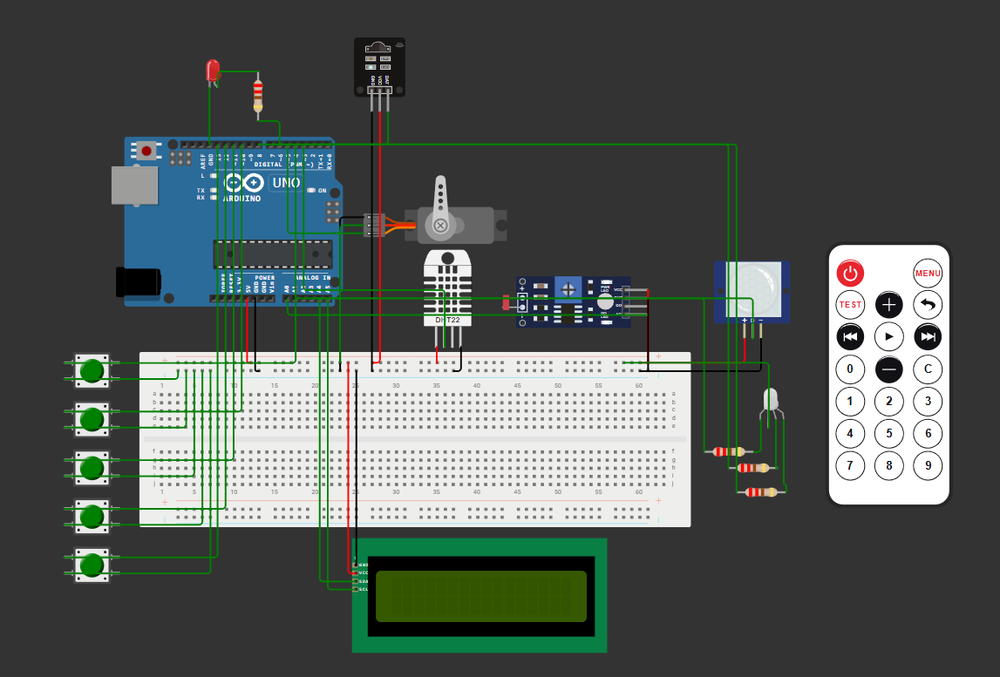
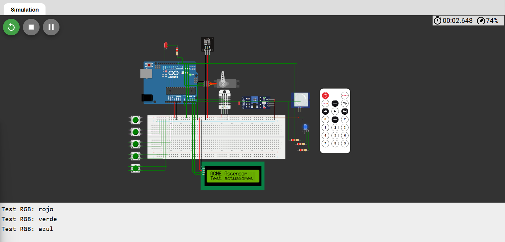
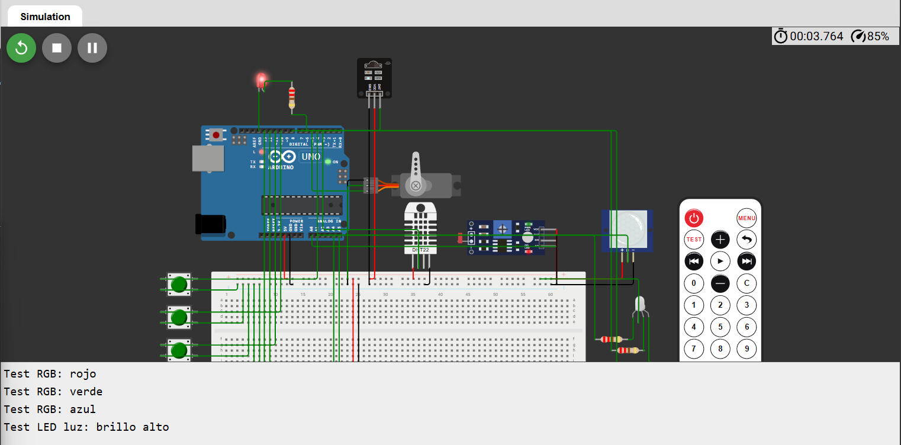
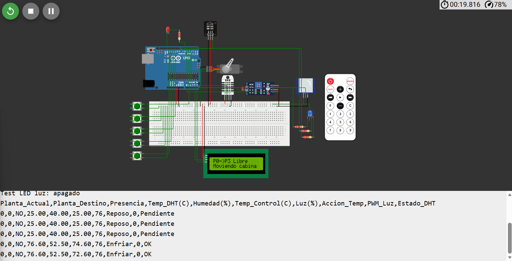
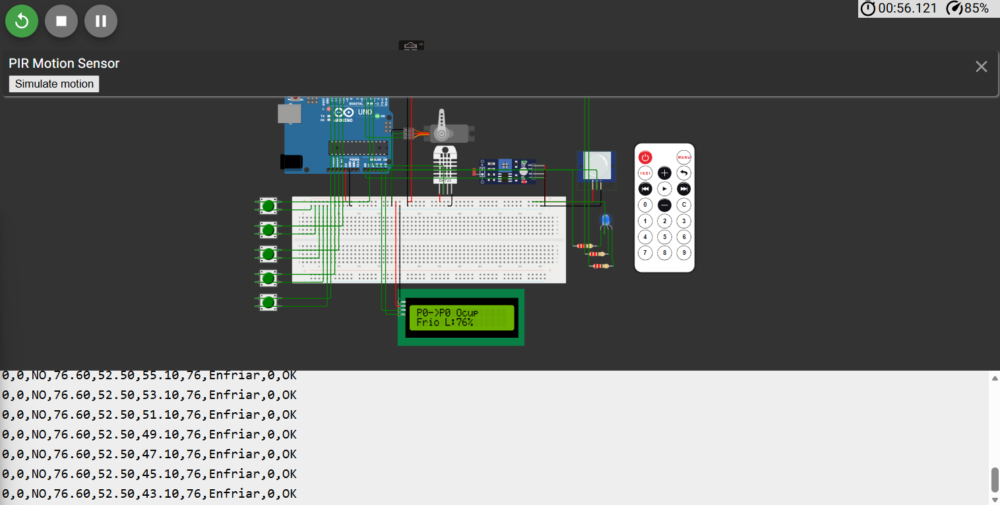
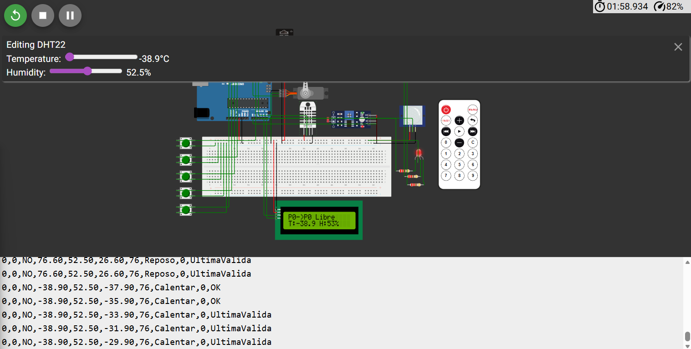
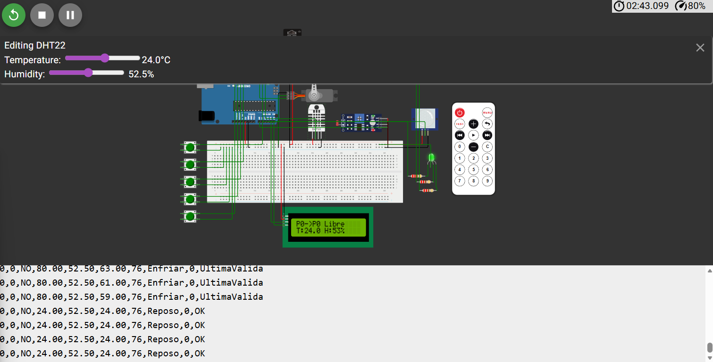
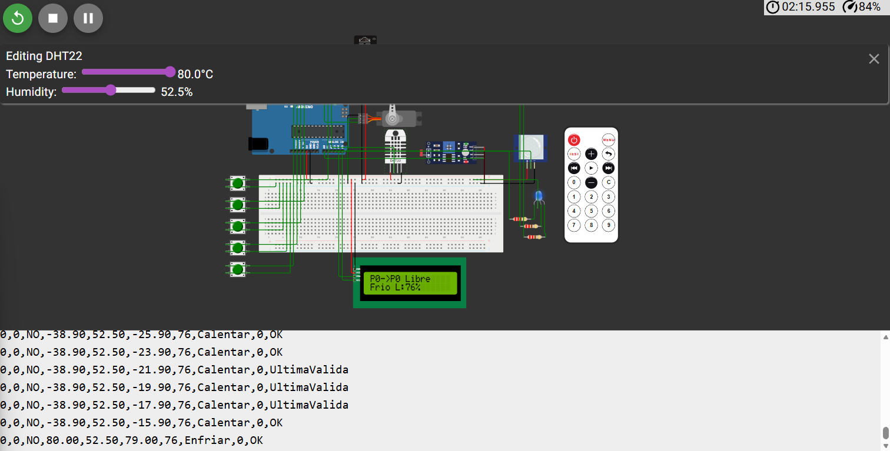
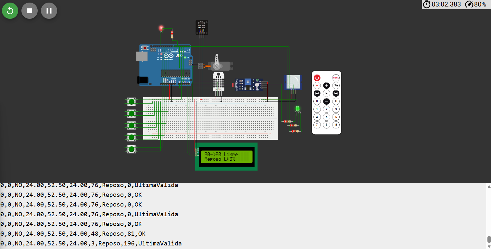

# Actividad 2 - Ascensor inteligente ACME S.A.

## Descripción

Este proyecto corresponde a la Actividad 2 de la asignatura Equipos e Instrumentación Electrónica. El objetivo es simular en Wokwi el funcionamiento de un ascensor inteligente de cinco plantas, incorporando lógica de control, sensores ambientales, actuadores y una interfaz HMI local mediante pantalla LCD.

El sistema permite seleccionar la planta de destino mediante pulsadores físicos o mediante un mando a distancia por infrarrojos. El movimiento de la cabina se representa mediante un servomotor. Además, se registra la presencia de usuarios en la cabina y se supervisan variables ambientales como temperatura, humedad e iluminación.

## Enlace a la simulación Wokwi

https://wokwi.com/projects/463551742395608065

## Componentes utilizados

- Arduino UNO
- Servomotor SG90
- Receptor IR y mando a distancia
- Cinco pulsadores de llamada
- Sensor PIR
- Sensor DHT22
- Sensor LDR
- LED RGB
- LED de iluminación artificial
- Pantalla LCD 16x2 I2C
- Resistencias

## Asignación de pines

- IR: D2
- DHT22: D3
- Pulsador planta 0: D4
- Servo: D5
- LED iluminación artificial: D6
- RGB verde: D7
- RGB azul: D8
- Pulsador planta 1: D10
- Pulsador planta 2: D11
- Pulsador planta 3: D12
- Pulsador planta 4: D13
- LDR: A0
- PIR: A1
- RGB rojo: A3
- LCD SDA: A4
- LCD SCL: A5

## Funcionamiento

El ascensor dispone de cinco plantas, numeradas de 0 a 4. Cada planta se asocia a una posición angular del servomotor: planta 0 a 0°, planta 1 a 45°, planta 2 a 90°, planta 3 a 135° y planta 4 a 180°.

Las llamadas pueden realizarse mediante pulsadores físicos o mediante el mando IR. Las teclas 0, 1, 2, 3 y 4 del mando envían el ascensor a las plantas correspondientes.

El sensor PIR detecta si existe presencia en la cabina. El sensor DHT22 mide temperatura y humedad, mientras que el LDR mide el nivel de iluminación ambiental.

El sistema aplica un control ON-OFF con zona muerta para la temperatura. La consigna se fija en 25 °C con una zona muerta de ±2 °C. Si la temperatura es baja, se activa la acción de calentamiento y el RGB se muestra en rojo. Si la temperatura está dentro del rango aceptable, el sistema permanece en reposo y el RGB se muestra en verde. Si la temperatura es alta, se activa la acción de enfriamiento y el RGB se muestra en azul.

La iluminación artificial se controla mediante PWM. Cuando la luz ambiental baja por debajo del umbral, el LED de iluminación aumenta su intensidad.

## Pruebas realizadas

Se realizaron pruebas de arranque, movimiento mediante pulsadores, movimiento mediante mando IR, detección de presencia, medición de temperatura y humedad, control térmico, control de iluminación y registro por monitor serie.

## Capturas

### Montaje completo

### Test de actuadores

### Movimiento del ascensor

### Mando IR

### Presencia detectada

### Lectura DHT22

### Control térmico

### Control de iluminación

## Archivos del proyecto

- `sketch.ino`: código fuente de Arduino.
- `diagram.json`: montaje de la simulación en Wokwi.
- `libraries.txt`: librerías necesarias para ejecutar el proyecto.
- `wokwi-project.txt`: enlace o información del proyecto Wokwi.
- `capturas/`: evidencias gráficas de las pruebas realizadas.

## Conclusiones

El sistema desarrollado permite simular de forma funcional un ascensor inteligente de cinco plantas, integrando adquisición de datos, control, actuación, visualización y registro. La solución cumple los objetivos de la actividad y constituye una base adecuada para futuras ampliaciones IoT.
